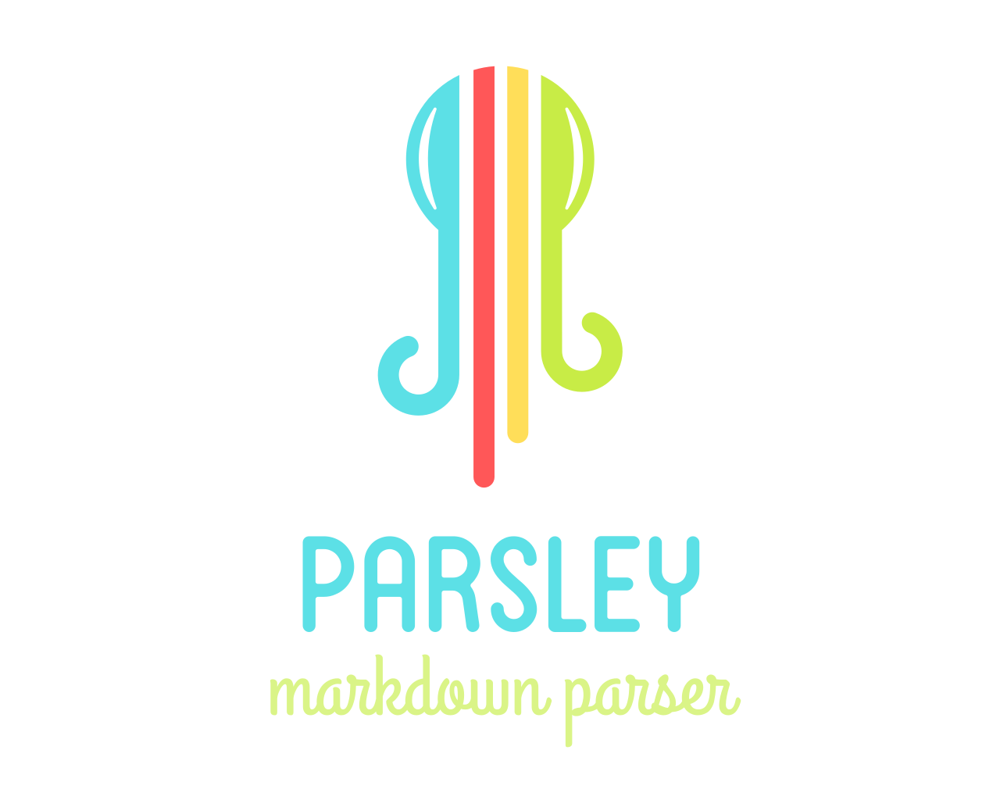

<p align="center">
  
</p>

A Markdown parser for Swift Package Manager, using [Github Flavored Markdown](https://github.github.com/gfm/). As such it comes with a bunch of Markdown extensions such as fenced code blocks, tables, strikethrough, hard line breaks and auto links.

Additionally Parsley supports embedded metadata in Markdown documents, and it splits the document title out from the document body.

``` swift
let input = """
---
author: Kevin
tags: Swift, Parsley
---

# Hello World
This is the body
"""

let document = try Parsley.parse(input)
print(document.title) // Hello World
print(document.body) // <p>This is the body</p>
print(document.metadata) // ["author": "Kevin", "tags": "Swift, Parsley"]
```


## Install
Parsley is available via Swift Package Manager and runs on macOS and Linux.

```
.package(url: "https://github.com/loopwerk/Parsley", from: "0.5.0"),
```


## Use as a reader in Saga
Parsley can be used as a reader in the static site generator [Saga](https://github.com/loopwerk/Saga), using [SagaParsleyMarkdownReader](https://github.com/loopwerk/SagaParsleyMarkdownReader).


## Code block attributes
Parsley supports adding attributes to fenced code blocks. Attributes are placed after the language on the opening fence line using curly braces:

~~~markdown
```python {.highlight data-title="views.py"}
def hello():
    print("Hello, World!")
```
~~~

```html
<pre class="highlight" data-title="views.py"><code class="language-python">def hello():
    print("Hello, World!")
</code></pre>
```

As a shorthand, a title can also be specified without curly braces:

~~~markdown
```python title="views.py"
def hello():
    print("Hello, World!")
```
~~~

This is equivalent to `{data-title="views.py"}` and generates:

```html
<pre data-title="views.py"><code class="language-python">def hello():
    print("Hello, World!")
</code></pre>
```

You can then use CSS to display the title, for example:

```css
pre[data-title]::before {
  content: attr(data-title);
  display: block;
  background: #1a1a1a;
  padding: 0.5em 1em;
  font-size: 0.85em;
  border-bottom: 1px solid #333;
}
```

## Markdown attributes
With the `.markdownAttributes` option, Parsley supports adding attributes to headings, images, and other block-level elements using a syntax similar to [Hugo's markdown attributes](https://gohugo.io/content-management/markdown-attributes/):

```swift
let html = try Parsley.html(input, options: [.markdownAttributes])
let document = try Parsley.parse(input, options: [.markdownAttributes])
```

Attributes are specified inside curly braces `{...}` and support the following shorthand notations:

| Notation | HTML result |
|----------|------------|
| `.myclass` | `class="myclass"` |
| `#myid` | `id="myid"` |
| `key="value"` | `key="value"` |

Multiple classes are merged: `{.foo .bar}` becomes `class="foo bar"`.

### Headings

Attributes are placed at the end of the heading line:

```markdown
## My heading {.special #intro}
```

```html
<h2 class="special" id="intro">My heading</h2>
```

### Block elements

For paragraphs, blockquotes, lists, horizontal rules, and tables, place the attributes on their own line directly after the element:

```markdown
This is a paragraph.
{.note}

> A blockquote.
{.warning}

* First
* Second
{.checklist}

---
{.divider}
```

```html
<p class="note">This is a paragraph.</p>
<blockquote class="warning">
<p>A blockquote.</p>
</blockquote>
<ul class="checklist">
<li>First</li>
<li>Second</li>
</ul>
<hr class="divider" />
```

### Standalone images

When an image is the only content in a paragraph, attributes are applied directly to the `` element:

```markdown

{.hero}
```

```html
<p></p>
```

## Modifying the generated HTML
Parsley doesn't come with a plugin system, it relies purely on `cmark-gfm` under the hood to render Markdown to HTML. If you want to modify the generated HTML, for example if you want to add `target="blank"` to all external links, [SwiftSoup](https://github.com/scinfu/SwiftSoup) is a great way to achieve this.

## Code block syntax highlighting
If you want to add syntax highlighting to the code blocks, you could use a client-side JavaScript library such as [Prism](https://prismjs.com) or [highlight.js](https://highlightjs.org). Or for a server-side solution, check out [Moon](https://github.com/loopwerk/Moon), which runs Prism in Swift:

```swift
import Parsley
import Moon

let html = try Parsley.html(markdown)
let highlighted = Moon.shared.highlightCodeBlocks(in: html)
```
